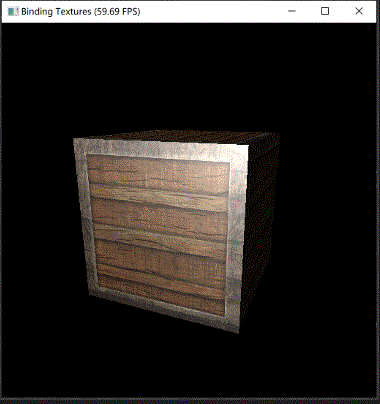

# Binding textures

In the [previous section](loading_models.md), you've successfully loaded a `cube.obj` and display it.
But its surface is just plain white till now, can't we make it more colorful, look like a real thing?

## Adding texture

Now I want to make the cube look like an wooden box. What we need is **texture**.

Let's download this image and save it to `container2.png`:


?> Or, feel free to use your own images :)

Then, add this line to load the image onto the model:

```py
model.add_texture('color', t3.imread('container2.png'))
```

The `'color'` tells Taichi THREE to **sample** colors from that image.

Running it you'll obtain a wooden container:


## Specular map

Pretty cool, right? But the metal border of the container doesn't look like metal.
In fact, it looks completely no difference from the wood part...

To make metal look like metal, we want it to **shine**.
But we don't want the wood part **shine** too.

To do so, what we need is a **specular map**, it's also a kind of texture.
Each pixel in the specular map represents **how specular rate is** at that point.

Let's download this image and save to `container2_specular.png`:


And add this line:

```py
model.add_texture('specular', t3.imread('container2_specular.png'))
```



Now our eyes can easily distinguish metal from wood by their specular rate.
Moving the camera around, you'll see the specular center on metal to move.

Congrats on making the result more realistic!


## Appendix

And here's the final code of this section:

[binding_textures.py](_media/binding_textures.py ':include :type=code')