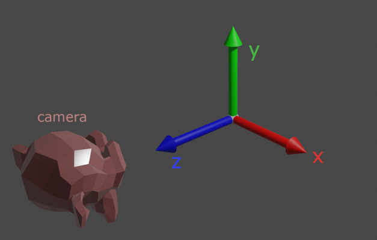

# Cordinate system

This section will give you a brief introduction into the coordinate system of Taichi THREE, and the affine transformation system of it.

## World space

The coordinate system of the `Scene` is called **world space**.

It has three dimensions, X, Y, and Z (of course).

Their directions are defined as follows:

* The X axis points towards right.
* The Y axis points towards up.
* The Z axis points towards front.

## Camera

By default, the camera is located **in front of** the scene.
That is, the camera is looking from +Z to -Z.

## Screen space

All the 3D objects will be finally display on a 2D screen, which only has two dimensions, X and Y.

The screen space axes are defined as follows:

* The X axis points from left to right.
* The Y axis points from down to up.

So the left-bottom corner is `(0, 0)` in Taichi THREE.

## Face culling

Only faces that are counter-clockwise will be displayed on the screen, this is for performance reason.

