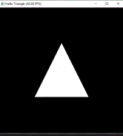
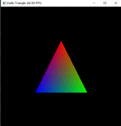

# Hello triangle

The goal of this section is to give a brief introduction to Taichi THREE. We will start by setting up a scene, with a simple triangle, as many OpenGL tutorial starts from too.
A working example is provided at the bottom of the page in case you get stuck and need help.

## Creating the scene

To actually be able to display anything with Taichi THREE, we need three things: scene, camera, and model, so that we can render the scene with camera.

Scene - the collection of all renderer resources.
Camera - take images from scene and display it on the screen.
Model - the object to be displayed in the scene, a triangle in this case.

```py
scene = t3.Scene()
camera = t3.Camera()
scene.add_camera(camera)

model = t3.SimpleModel(faces_n=1, pos_n=3)
scene.add_model(model)
```

The `faces_n` indicates how much faces the model have, the `pos_n` indicates how much vertices the model have.
Finally, don't forget to **add** the model and camera to scene.

## Loading mesh data

In the world of Taichi THREE (and many other modern rendering pipelines), a model is composed of many pieces of triangle faces, and their vertices.
Each triangle face has 3 vertices at its corner.

The positions, colors, and other properties of vertices are stored separately in the **vertex buffer**.
The vertex-face corespondence for each face, is composed of 3 indices into vertex buffer.

```py
model.pos[0] = [+0.0, +0.5, 0.0]  # top
model.pos[1] = [-0.5, -0.5, 0.0]  # right
model.pos[2] = [+0.5, -0.5, 0.0]  # left
model.faces[0] = [0, 1, 2]        # each triangle face contains 3 indices into its vertices
```

## Visualizing the scene

If you copied the code from above and run, you wouldn't be able to see anything. This is because we're not actually rendering anything yet. For that, we need what's called an animate loop.

The good news is that we've already intergrated a simple GUI system that is able to render animation in real-time, to utilize it, just:

```py
gui = t3.GUI('Hello Triangle')
while gui.running:
    scene.render()
    gui.set_image(camera.img)  # blit the image captured by `camera` to screen
    gui.show()
```

Till now running the code successfully show gives you an white triangle in the middle of screen:



## Specifying vertex colors

Mesh vertices could also has properties. The most commonly used property is, of course, color.

To specify a color for each vertex, simply assign some RGB values to the `model.clr` field:

```py
model.pos[0] = [+0.0, +0.5, 0.0]
model.pos[1] = [-0.5, -0.5, 0.0]
model.pos[2] = [+0.5, -0.5, 0.0]
model.clr[0] = [1.0, 0.0, 0.0]    # red
model.clr[1] = [0.0, 1.0, 0.0]    # green
model.clr[2] = [0.0, 0.0, 1.0]    # blue
model.faces[0] = [0, 1, 2]
```

Then the color of each pixel in the triangle will then be a **interpolation** of its 3 vertices, via its barycentric coordinate.

Run it and you should see a colorful triangle as shown below:



## Controling the camera with mouse

We can also move the camera by mouse. To do so, we'll need to capture some mouse events in our GUI loop, and feed it into the `camera`:

```py
gui = t3.GUI('Hello Triangle')
while gui.running:
    gui.get_event(None)  # receive mouse and key events from GUI
    camera.from_mouse(gui)  # let the camera to process the mouse events
    scene.render()
    gui.set_image(camera.img)
    gui.show()
```

Now use **LMB to orbit** around the scene, **MMB to move** the center of view, **RMB to scale** the scene.
Feel like moving in 3D, right? Exactly what we want!


## Face culling

Turning the camera around using LMB, you may already noticed that the triangle is **invisible** when we moved to its back.

That's because Taichi THREE use the **face culling policy**: a face is only visible when the vertices are **clockwise**.
Why do we set this strange limitation? Well, you'll know in the later sections.


For example, we used `[0, 1, 2]` as vertex indices, so the ordered vertices are:
1. ``x=+0.0, y=+0.5``
2. ``x=-0.5, y=-0.5``
3. ``x=+0.5, y=-0.5``

Looking from -Z direction, they are clockwise (therfore visible).
Looking from +Z direction, they are counter-clockwise (therfore invisible).

## Make both side visible

The face culling can't be **disabled** in Taichi THREE for simplicity and performance.

So in order to make both side visible, we'd create two faces, one face towards -Z, another face towards +Z:

```py
model = t3.SimpleModel(faces_n=2, pos_n=3)

...

model.faces[0] = [0, 1, 2]  # looks clockwise from -Z
model.faces[1] = [0, 2, 1]  # looks clockwise from +Z
```


## Appendix

And here's the final code of this section:

[hello_triangle.py](_media/hello_triangle.py ':include :type=code')