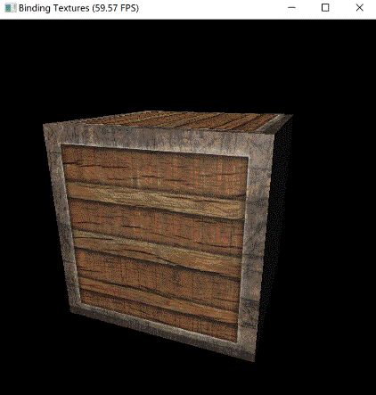

# Binding textures

In [Hello Cube](hello_cube.md), you've successfully loaded a cube and display it.
But its surface is just plain white till now, can't we make it more colorful, look like a real thing?
Of course! We may want to replaced the default material in this case.

## Specifying material colors

In Taichi THREE, materials are considered as **nodes**. You may override the default node to specify your own material properties.

Let's get started by replace the default white color by red:

```py
model.material = t3.Material(t3.BlinnPhong(    # use Blinn-Phong shader
    color=t3.Constant(t3.RGB(1.0, 0.0, 0.0)),  # red
))
```


## Adding texture

Now I want to make the cube look like an wooden box rather than plain colors. What we need is **texture**.

Let's download this image and save it to `container2.png`:


Then, add this line to specify the **material node** of the model:

```py
model.material = t3.Material(t3.BlinnPhong(
    color=t3.Texture('container2.png'),
))
```

The `color` tells Taichi THREE to **sample** colors from that image.

Running it you'll obtain a wooden container:



## Specular rate

Pretty cool, right? But the metal border of the container doesn't look like metal.

To make metal look like metal, we want it to **shine**.
Using the Blinn-Phong shader, we may set its `specular` paramter to `1.0`.
The `specular` parameter is simply the specular rate of material.
The higher the `specular` is, the more the material shines.

```py
model.shading = t3.BlinnPhong       # use Blinn-Phong shader
model.material = t3.Material(t3.BlinnPhong(
    color=t3.Texture('container2.png'),
    specular=t3.Constant(1.0),  # set a constant specular rate: 1.0
))
```


## Specular as texture

But wait, we don't want the wood shine too!

So, `t3.Constant` can only specify an parameter uniformly over the whole model.
It can't deal with a model with multiple materials on its face.

To specify a different specular rate for each pixel, we need a **specular map**, it's also a kind of texture.
Each pixel in the specular map represents how specular rate is at that point.

Let's download this image and save to `container2_specular.png`:


?> See? Only the metal border pixels are set so only these pixels will shine.

And replace the `t3.Constant` with this line in our script:

```py
model.add_texture('specular', t3.imread())
model.material = t3.Material(t3.BlinnPhong(
    color=t3.Texture('container2.png'),
    specular=t3.Texture('container2_specular.png'),  # let Taichi THREE sample specular rate from this texture
))
```


Now metal are shining and woods look like woods.
Congrats on yielding a more realistic result!


## Appendix

And here's the final code of this section:

[binding_textures.py](_media/binding_textures.py ':include :type=code')