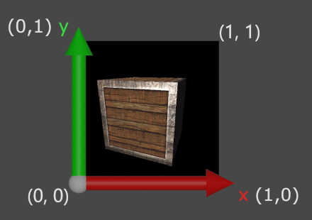

# Cordinate system

This section will give you a brief introduction into the coordinate system of Taichi THREE, and the affine transformation system of it.


## World space

The coordinate system of the `Scene` is called **world space**.

It has three dimensions, X, Y, and Z (of course).

Their directions are defined as follows:

* The X axis points towards right.
* The Y axis points towards up.
* The Z axis points towards front.


## Camera

By default, the camera is located **in front of** the scene.
That is, the camera is looking from +Z to -Z.


## Screen space

All the 3D objects will be finally display on a 2D screen, which only has two dimensions, X and Y.

The screen space axes are defined as follows:

* The X axis points from left to right.
* The Y axis points from down to up.

So the left-bottom corner is `(0, 0)` in Taichi THREE.




## Face culling

Only faces that are counter-clockwise will be displayed on the screen, this is for performance reason.


## Affine transformations

The transformation from model space to world space, is stored as a 4x4 matrix in `model.L2W[None]`.

You could specify a transform matrix for each model, for example:

1. Translate alone positive X-axis for 0.3:
```py
model.L2W[None] = t3.translate(0.3, 0, 0)
```

2. Scale to 0.5 of original size:
```py
model.L2W[None] = t3.scale(0.5)
```

3. Rotate around Y-axis for 45 degrees (Z to X):
```py
model.L2W[None] = t3.rotateY(t3.pi / 4)
```

4. Rotate around Y-axis for 45 degrees, then translate alone X-axis for 0.3:
```py
model.L2W[None] = t3.translate(0.3, 0, 0) @ t3.rotateY(t3.pi / 4)
```

## Rotating cube

For example, to make the cube in [Hello Cube](hello_cube.md) rotate by time:

[rotating_cube.py](_media/rotating_cube.py ':include :type=code')